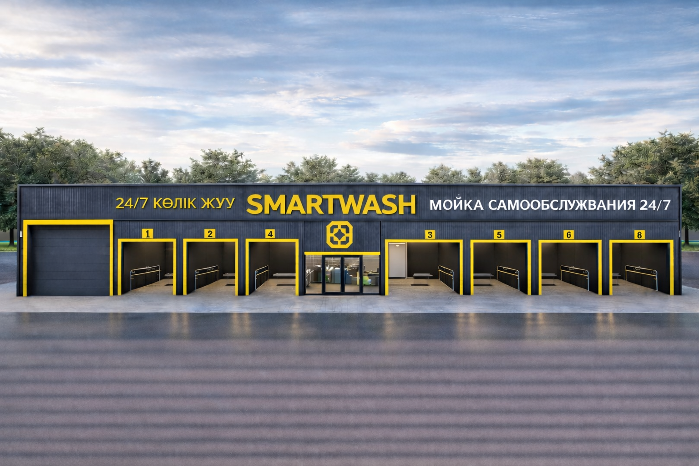

# SMARTWASH — Мойка самообслуживания 24/7

> Автоматизированная мойка самообслуживания на **8 постов**, режим работы **24/7**,
> г. Актобе, ул. Макаренко 5А. Здание из металлокаркаса на фундаменте, все боксы — для легковых авто.

Этот файл — **контент-база для сайта-презентации** проекта и **трекера хода реализации**.
Все изображения лежат в папке `./images/` и прописаны ниже в нужных разделах.

---

## 1. О проекте

**SMARTWASH** — это современная мойка самообслуживания формата 24/7. Клиент сам моет авто на
оборудованном посту (аппарат высокого давления, пена, воск, ополаскивание, пылесос), оплачивая
время через терминал. Минимум персонала, круглосуточный режим, высокая маржинальность.

| Параметр | Значение |
|---|---|
| Формат | Мойка самообслуживания |
| Количество постов | **8** (все — для легковых авто) |
| Режим работы | **24/7** |
| Здание | Металлокаркас на фундаменте, **40 × 6 м, высота 5 м** |
| Насосная | По центру здания |
| Источник воды | Собственная скважина |
| Инвестиции «под ключ» | **≈ 87,9 млн тг** |
| Окупаемость | **≈ 19 мес** (реалистичный сценарий) |
| Средний чек | **900 тг** |

**Главная визуализация (3D-рендер фасада):**



---

## 2. Концепция и формат

- **8 моечных постов**, все рассчитаны на **легковые автомобили**.
- **Режим 24/7** — круглосуточная работа без выходных.
- **Насосная по центру** здания — короткие трассы до всех постов, удобное обслуживание.
- **Ролл-шторы (рольставни)** на боксах — тёплый контур, работа зимой.
- **LED-освещение** постов и фасада — яркая видимость и безопасность ночью.
- **Платёжные терминалы** на каждом посту (нал/безнал/QR/Kaspi).
- **Собственная скважина** — независимость от водоснабжения и низкая себестоимость воды.

**Реальные фото мойки этого формата (референс готового объекта):**


---

## 3. Локация

| | |
|---|---|
| Адрес | г. Актобе, ул. Макаренко, 5А (район Астана) |
| Расположение | Угловой участок, перекрёсток **Макаренко × Рыскулова** |
| Кадастровый номер | 02-036-146-7483 |
| Окружение | Жилмассив, частный сектор, общежитие мед-университета, мед-центр, почта, АЗС |
| Трафик | 1-я линия по оживлённой ул. Макаренко |

**Фото участка (текущее состояние площадки):**


**Визуализация мойки на участке (фотомонтаж):**


**Визуализация с асфальтом и парковкой перед мойкой:**


---

## 4. Габариты и конструкция

| Параметр | Значение |
|---|---|
| Габариты здания | **40 × 6 м** |
| Высота | **5 м** |
| Площадь застройки | ≈ 240 м² |
| Конструкция | **Металлокаркас на фундаменте** |
| Профиль каркаса | Профтруба **100×100, 80×80, 60×60, 40×40 мм** |
| Обшивка | Сэндвич-панели / профлист, утепление |
| Асфальт перед зданием | **8–9 м** (въездная зона) |
| Благоустройство / асфальт | ≈ 1000 м² |
| Фасад | ≈ 493 м² |

**Чертёж фасада (развёртка 8 постов с брендингом):**


**Эскизы металлокаркаса и узлов:**


**Расчёт металла и площадей (рукописные заметки):**


---

## 5. Планировка

8 постов расположены вдоль здания (40 м), **насосная (технический блок) — по центру**,
въезд/выезд через передний асфальт (8–9 м), все боксы — под легковые авто.

**Схема компоновки (план, насосная по центру, парковка спереди):**


**Печатный план объекта:**


**Эскиз планировки с размерами участка:**


---

## 6. Финансовая модель

> Базовый (реалистичный) сценарий. Цифры из инвестиционного меморандума проекта.

### Инвестиции (CAPEX) — ≈ 87,9 млн тг

| Статья | Сумма, тг | Доля |
|---|---:|---:|
| Строение (каркас, фундамент, обшивка, кровля) | 30 182 000 | 34% |
| Оборудование (АВД, насосная, пылесосы, терминалы) | 26 905 000 | 31% |
| Инфраструктура (сети, водоподготовка, асфальт) | 23 774 000 | 27% |
| Маркетинг и резерв | 7 000 000 | 8% |
| **ИТОГО** | **87 861 000** | **100%** |


### Операционная модель (в месяц)

| Показатель | Реалистичный | Пессимистичный |
|---|---:|---:|
| Выручка | 7 560 000 тг | 3 840 000 тг |
| OPEX (≈ 38% выручки) | 2 910 800 тг | — |
| **EBITDA** | **4 649 200 тг** | 1 840 000 тг |
| Средний чек | 900 тг | 900 тг |
| **Окупаемость** | **≈ 19 мес** | ≈ 47 мес |


---

## 7. Прогресс реализации (трекер)

> Текущий этап: **Бурение скважины**. Остальные этапы — по очереди ниже.
> Для интерактивного трекера на сайте используй структурированные данные в блоке
> «Данные для трекера» (раздел 9).

| № | Этап | Статус | Прогресс |
|---|---|---|---:|
| 1 | **Бурение скважины** (источник воды) | 🟡 В работе | 10% |
| 2 | Земляные работы и фундамент | ⚪ Запланировано | 0% |
| 3 | Монтаж металлокаркаса (40×6×5) | ⚪ Запланировано | 0% |
| 4 | Обшивка, утепление, кровля | ⚪ Запланировано | 0% |
| 5 | Инженерные сети, водоподготовка, насосная | ⚪ Запланировано | 0% |
| 6 | Оборудование 8 постов (АВД, пена, пылесосы, терминалы) | ⚪ Запланировано | 0% |
| 7 | Ролл-шторы, ворота, LED-освещение, вывеска | ⚪ Запланировано | 0% |
| 8 | Асфальт, благоустройство, парковка | ⚪ Запланировано | 0% |
| 9 | Пусконаладка и тестовые мойки | ⚪ Запланировано | 0% |
| 10 | Открытие 24/7 | ⚪ Запланировано | 0% |

### Этап 1 — Бурение скважины 🟡

**Статус:** в работе · **Прогресс:** 10%
Бурение собственной скважины — источник воды для мойки. Обеспечивает независимость от
центрального водоснабжения и низкую себестоимость воды. Включает: бурение, обсадку,
установку насоса, обвязку и подвод к будущей насосной.

_Фото с площадки: добавляй сюда по мере работ → `images/progress/01-skvazhina-*.jpg`_

### Этап 2 — Земляные работы и фундамент ⚪
Подготовка площадки, разметка, рытьё, ленточно-плитный фундамент под металлокаркас.

### Этап 3 — Монтаж металлокаркаса ⚪
Сборка несущего каркаса из профтрубы (100×100…40×40), габариты 40×6 м, высота 5 м.

### Этап 4 — Обшивка, утепление, кровля ⚪
Сэндвич-панели/профлист, утепление, кровля — тёплый контур здания.

### Этап 5 — Инженерные сети, водоподготовка, насосная ⚪
Электрика, отопление, канализация, система водоподготовки и очистки, монтаж насосной по центру.

### Этап 6 — Оборудование 8 постов ⚪
Аппараты высокого давления, пеногенераторы, пылесосы, платёжные терминалы на каждом посту.

### Этап 7 — Ролл-шторы, ворота, LED, вывеска ⚪
Рольставни на боксах, LED-освещение, монтаж вывески SMARTWASH и фасадного брендинга.

### Этап 8 — Асфальт и благоустройство ⚪
Асфальтирование (≈ 1000 м²), въездная зона 8–9 м, парковка, разметка, освещение территории.

### Этап 9 — Пусконаладка и тесты ⚪
Запуск оборудования и водоподготовки, тестовые мойки, отладка терминалов.

### Этап 10 — Открытие 24/7 ⚪
Запуск мойки в режиме 24/7, маркетинг открытия.

---

## 8. Каталог изображений

Все файлы — в папке `./images/`.

| Файл | Что на нём | Где использовать на сайте |
|---|---|---|
| `render-3d.png` | 3D-рендер фасада, 8 постов | Hero / обложка |
| `viz-on-site.png` | Мойка на участке + данные | Локация / визуализация |
| `viz-on-site-clean.png` | Мойка на участке, чистый вид | Галерея |
| `viz-parking.png` | Асфальт + парковка + данные | Визуализация |
| `viz-parking-clean.png` | Асфальт + парковка, чистый | Галерея |
| `site-empty.png` | Пустой участок (текущее состояние) | Локация / «было» |
| `facade-elevation.jpg` | Чертёж-развёртка фасада | Конструкция / фасад |
| `photo-facade-1.jpg` | Фото мойки (вывеска, посты) | Референс / галерея |
| `photo-facade-2.jpg` | Фото фасада, посты 5–8 | Референс / галерея |
| `photo-facade-3.jpg` | Фото фасада под углом | Референс / галерея |
| `photo-post-closeup.jpg` | Пост крупным планом | Концепция / детали |
| `photo-logo-entrance.jpg` | Логотип и вход | Брендинг |
| `plan-layout.png` | Схема: 40×6, насосная центр, парковка | Планировка |
| `plan-printed.jpg` | Печатный план объекта | Планировка |
| `plan-sketch-dims.jpg` | Эскиз с размерами участка | Планировка / документы |
| `structure-sketch-1.jpg` | Эскиз каркаса (узлы, 5 м) | Конструкция |
| `structure-sketch-2.jpg` | Эскиз каркаса (фермы, колонны) | Конструкция |
| `metal-specs-notes.jpg` | Расчёт металла и площадей | Конструкция / смета |
| `chart-capex.png` | Диаграмма инвестиций | Финансы |
| `chart-payback.png` | Кривая окупаемости | Финансы |

> Для фото хода работ создавай подпапку `images/progress/` с именами вида
> `01-skvazhina-01.jpg`, `02-fundament-01.jpg` и т.д.

---

## 9. Данные для трекера (структурировано)

Готовый блок данных для интерактивного трекера прогресса на сайте.

```yaml
project:
  name: SMARTWASH
  tagline: Мойка самообслуживания 24/7
  address: г. Актобе, ул. Макаренко 5А
  posts: 8
  mode: 24/7
  building: 40 x 6 x 5 m
  investment_tg: 87861000
  payback_months: 19
  ebitda_month_tg: 4649200
  avg_check_tg: 900

finance:
  capex:
    - { item: "Строение", amount_tg: 30182000, share: 34 }
    - { item: "Оборудование", amount_tg: 26905000, share: 31 }
    - { item: "Инфраструктура", amount_tg: 23774000, share: 27 }
    - { item: "Маркетинг и резерв", amount_tg: 7000000, share: 8 }
  monthly:
    realistic: { revenue_tg: 7560000, opex_tg: 2910800, ebitda_tg: 4649200, payback_months: 19 }
    pessimistic: { revenue_tg: 3840000, ebitda_tg: 1840000, payback_months: 47 }

progress:
  - { id: 1,  stage: "Бурение скважины",                         status: "in_progress", percent: 10, image_dir: "images/progress" }
  - { id: 2,  stage: "Земляные работы и фундамент",              status: "planned",     percent: 0 }
  - { id: 3,  stage: "Монтаж металлокаркаса (40×6×5)",           status: "planned",     percent: 0 }
  - { id: 4,  stage: "Обшивка, утепление, кровля",               status: "planned",     percent: 0 }
  - { id: 5,  stage: "Инженерные сети, водоподготовка, насосная", status: "planned",    percent: 0 }
  - { id: 6,  stage: "Оборудование 8 постов",                    status: "planned",     percent: 0 }
  - { id: 7,  stage: "Ролл-шторы, ворота, LED, вывеска",         status: "planned",     percent: 0 }
  - { id: 8,  stage: "Асфальт, благоустройство, парковка",       status: "planned",     percent: 0 }
  - { id: 9,  stage: "Пусконаладка и тесты",                     status: "planned",     percent: 0 }
  - { id: 10, stage: "Открытие 24/7",                            status: "planned",     percent: 0 }

status_legend:
  done: "Готово"
  in_progress: "В работе"
  planned: "Запланировано"
```

---

## 10. Контакты

**SMARTWASH** · Мойка самообслуживания 24/7
г. Актобе, ул. Макаренко 5А

---

### Подсказки для сборки сайта (Claude Code)

- **Hero:** `render-3d.png` + заголовок «SMARTWASH — Мойка самообслуживания 24/7» + ключевые цифры (8 постов · 24/7 · окупаемость 19 мес).
- **Палитра:** графит `#23232A` фон, жёлтый `#FFC400` акцент, белый текст. Заголовки — жирный гротеск капсом.
- **Разделы:** О проекте → Концепция → Локация → Конструкция → Планировка → Финансы → **Прогресс реализации** → Галерея → Контакты.
- **Трекер прогресса:** строй из блока `progress` (раздел 9). Текущий этап — «Бурение скважины». Прогресс-бар по `percent`, статусы по `status_legend`. Для каждого этапа — слот под фото из `images/progress/`.
- **Галерея:** все файлы из раздела 8.
